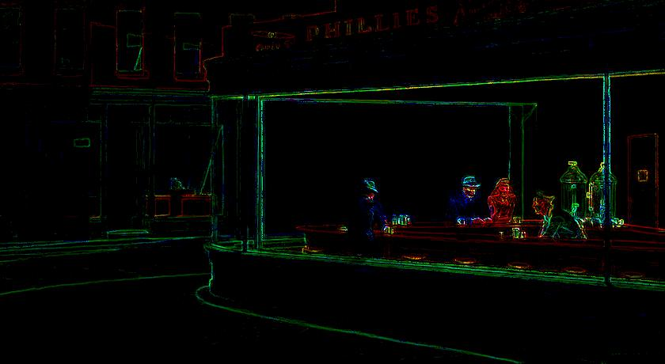

# hoca: an Higher-Order Cellular Automata Python Library

## Overview

## Installation
The latest version of `hoca` is installed via a standard pip command:

```shell
pip install hoca
```

## Documentation

All the code is documented and largely commented, and we strongly recommend taking a look at it.
However, in the following lines, we will introduce some concepts and present some examples.
But this matter could always be enhanced, so feel free to send us any comment, suggestion or question.

### Concepts

`hoca` relies on three concepts provided as classes and their subclasses: The fields, the populations, and
the automata.  
Fields hold the data processed by the automata population - a collection of agents - while populations
orchestrate the global behaviour of the automata.

#### Field classes

The `Field` abstract class (in the `hoca.core.automata_framework` module) provides a common set of definitions of
a field implementation. At the moment, there is only one implementation provided, the `ImageField`
subclass (in the `hoca.core.ImageField` module) that allows image manipulation.

Fields are data structures that hold the source data processed by an automata population,
or the result data produced by them. Fields can also be both source and result at the same time,
this way the automata can modify the field _in place_.  

For this purpose fields have an io_mode property that defines if they are:  
- readable: `io_mode == Field.IOMode.IN`
- writable: `io_mode == Field.IOMode.OUT`
- readable and writable: `io_mode == Field.IOMode.INOUT`

The `ImageField` class provides two convenience class methods:
- `from_image()` that creates an ImageField instance from an image file,
- `blank()` that creates an ImageField filled with zeros.

Once a field (or multiple ones) has been instantiated, it has to be packed in a Python dictionary before
being passed to the automata population. The key used along with the field will serve to select the data
to be read or written by the automata, and to name the logged data.

To facilitate the preparation of the necessary field(s) to be supplied to an automata population, one may
call the `build_field_dict()` class method that all the automata classes must provide.

#### Population classes

The `Population` abstract class (in the `hoca.core.automata_framework` module) provides a minimal set
of definitions of the necessary methods for the automata population operation. The implementation of
these methods is provided in the `BasicPopulation` class (in the `hoca.core.BasicPopulation` module).

`BasicPopulation` offers two main methods:
- `run()` which runs all the automata once (i.e. one generation),
- `play()` which runs all the automata for multiple generations.

The first is the most _complex_ of the two as `play()` simply calls `run()` repeatedly.

`BasicPopulation` implements every features needed to achieve some task with a population of automata
(or at least the features we wanted to investigate), and it's quite easy to use:

1. Build a dictionary referencing one or more fields,
   
2. instantiate a `BasicPopulation` passing the field dictionary and an automata class to it,
   
3. play the population for a while.

The result of the automata process will be in the fields and that's maybe all one want. However, to have
a clearer view on what's going on with the automata population or for debugging purpose, `hoca` provides
a `BasicPopulation` subclass: The `CallbackPopulation` (in the `hoca.monitor` module).

The `CallbackPopulation` works the same as the `BasicPopulation` but it allows providing callbacks that are
invoked at the end of each generation (more on that below). These callbacks can log some information about
the state of the population or build a video of the movements of the automata.

#### Automata class

The `Automata` abstract class (in the `hoca.core.automata_framework` module) defines the methods all
automaton classes must implement. There are three important methods:

- The `build_field_dict()` class method is responsible for building a well-formed field dictionary in order
  for the automata of this class to be able to process the data they contain. The field dictionary will be
  passed to the population later on.
  
- The `run()` method defines the behaviour of each automaton instance of the implemented `Automaton`
  class. The `run()` method is in charge of:
  - Moving the automaton, and
  - updating the field(s).
  
- The `get_status()` method computes and returns the current status of the automaton. This method will be
  invoked on each generation for each automaton.
  
### Getting started with hoca

The `hoca.demo.LiteEdgeAutomaton` module provides the `LiteEdgeAutomaton` automata class. These automata
crawl an `ImageField` containing an image, and fill another `ImageField` with the contours found 
in the first.

We will now see how to write some code use this class: We have to build a field dictionary
to provide the source image and receive the contours drawn, constitute a population of `LiteEdgeAutomaton`,
and then _play_ the population. Here is the code:

```python
import random

from hoca.core.BasicPopulation import BasicPopulation
from hoca.demo.LiteEdgeAutomaton import LiteEdgeAutomaton

# It may be of some interest to init the pseudo random generator to get consistent result
# across multiple runs. This is optional.
random.seed('This is the seed')

# Build field
field_dict = LiteEdgeAutomaton.build_field_dict('images/EdwardHopper_Nighthawks_1942.jpg')

# Create the automata population
automata_count = 3800
automata_population = BasicPopulation(field_dict, automata_count, LiteEdgeAutomaton)

# Play the population
automata_population.play(stop_after=2700)

# Display the result
field_dict["result"].image.show()
```

Obviously, the code starts with the importation of the stuff it will need. It then initializes the field
dictionary. In order to do that, it calls the `build_field_dict()` convenience class method of the automata
class, passing it the image to process. In this case, the dictionary returned contains two items the
`"source"` field and the `"result"` field.  
Note the parameters of `build_field_dict()` may change from class to class as the data to be processed may
differ.

The automata population is created by instantiating the `BasicPopulation` class. The program passes the field
dictionary, the number of automata to instantiate and the class of the automata to it. The population is
then played for 2700 generations by calling the `play()` method.

Finally, the result field is displayed as an image. The field dictionary may also be accessed through the
corresponding property of the population instance (`automata_population.field_dict` here).


> Edward Hopper. Nighthawks, 1942. (CC0) The Art Institute of Chicago.  
> [https://www.artic.edu/artworks/111628/nighthawks](https://www.artic.edu/artworks/111628/nighthawks)  
> (_source field_)


> Hopper's Nighthawks after 2700 generations with 3800 LiteEdgeAutomaton automata.  
> (_result field_)

As the image representation of a field is a PIL Image class instance, it can be saved or manipulated in many
ways. See the [Pillow Image module documentation](https://pillow.readthedocs.io/en/stable/reference/Image.html)
for more information.

One can see the number of automata to instantiate or the number of generations as kind of magic numbers.
They depend on the job the automata are doing, or the data provided. For instance, these numbers have
probably to be increased if the source image is larger. 
In the case of the `LiteEdgeAutomaton`, these numbers are discussed in [1].

#### Let's make a video


  

## Limitations

At the moment, automata are not aware of each other. This means you can't use the `hoca` library
to implement classic automata, the Conway's game of life for instance. You can do it actually,
but it will be in O(N²) as each automaton will have to look at all other automata in the population
to know if some are its neighbours.

## Advertising hoca

It would be greatly appreciated by the authors if the images and other productions made with the `hoca` library
were accompanied by a citation naming it; something like:  

> This <work> was produced with the `hoca` library (https://pypi.org/project/hoca/).

You might also send us a little mail about what you're doing with `hoca`.

## Contribute !
`hoca` is an open-source library written at [Villa Arson](https://www.villa-arson.fr/) and
[I3S](https://www.i3s.unice.fr/) and released on GitHub under the LGPLv3 license.
The library is copyrighted by its contributors (see source file headers).

There is a lot of room for improvements, everyone is welcome to contribute if you find any bug or have ideas
for new features!

## Bibliography

[1] Formenti E., Paquelin JL. (2021) _High Order Cellular Automata for Edge Detection: A Preliminary Study_.
_In_: Cellular Automata. ACRI 2020. Lecture Notes in Computer Science, vol 12599. Springer,
Cham. https://doi.org/10.1007/978-3-030-69480-7_9